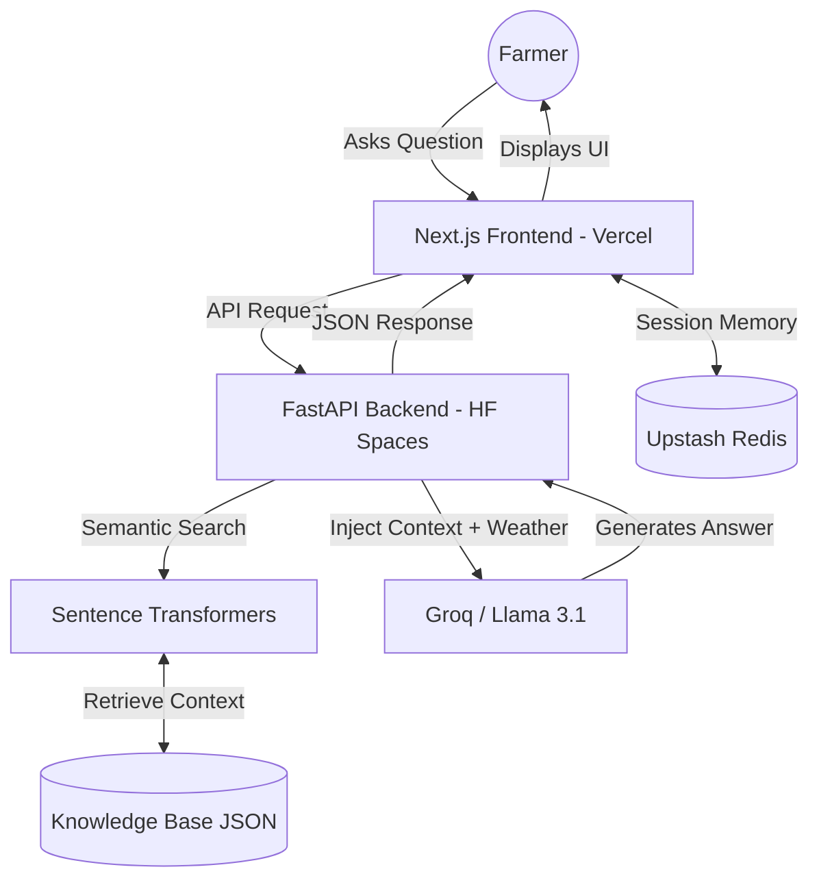

# 🌿 AgriBot: AI-Powered Indian Agriculture Assistant

AgriBot is a production-ready Conversational AI system designed to empower Indian farmers with verified agricultural knowledge. It uses **Retrieval-Augmented Generation (RAG)** to provide answers grounded in official data, preventing AI "hallucinations."

## 🚀 Key Features
- **RAG Architecture**: Answers are grounded in a knowledge base of 2,700+ Indian agricultural documents.
- **Multi-Turn Memory**: Powered by **Upstash Redis**, allowing the bot to remember previous questions in a session.
- **Live Weather Integration**: Injects real-time weather data from Open-Meteo for any Indian city.
- **Multilingual Support**: Optimized for English and Hindi agricultural queries.
- **Hybrid Cloud Deployment**: Backend on Hugging Face Spaces (GPU-optimized) and Frontend on Vercel (Edge-optimized).

## 🏗️ Technical Architecture



## 🛠️ Tech Stack
- **Frontend**: Next.js 16, Tailwind CSS 4, Lucide React.
- **Backend**: FastAPI (Python 3.10), Uvicorn.
- **AI Models**:
  - **Inference**: Groq (Llama 3.1 8B) for ultra-fast generation.
  - **Embeddings**: `all-MiniLM-L6-v2` (Sentence-Transformers).
- **Database**: Upstash Redis (Serverless).
- **Deployment**: GitHub Actions (CI/CD), Docker, Vercel.

## 📦 Project Structure
- `/backend`: Python API, RAG logic, and Knowledge Base.
- `/frontend`: Modern React chat interface with Markdown support.
- `.github/workflows`: Fully automated deployment pipeline.

## 🔧 Installation & Setup

### Local Development
1. **Backend**:
   ```bash
   cd backend
   pip install -r requirements.txt
   uvicorn main:app --reload
   ```
2. **Frontend**:
   ```bash
   cd frontend
   npm install
   npm run dev
   ```

### Deployment Configuration
Ensure the following environment variables are set:
- **GitHub Secrets**: `HF_TOKEN`, `VERCEL_TOKEN`, `VERCEL_ORG_ID`, `VERCEL_PROJECT_ID`.
- **Hugging Face Secrets**: `GROQ_API_KEY`.
- **Vercel Environment Variables**: `BACKEND_URL`, `UPSTASH_REDIS_REST_URL`, `UPSTASH_REDIS_REST_TOKEN`.

---
*Created with ❤️ for Indian Agriculture.*
