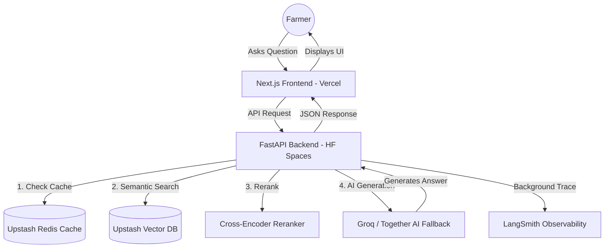

# 🌿 AgriBot: Premium AI-Powered Indian Agriculture Assistant

AgriBot is a high-performance, production-ready Conversational AI system designed to empower Indian farmers with verified agricultural intelligence. It leverages a modern **RAG (Retrieval-Augmented Generation)** architecture to provide expert-level advice grounded in official data.

## 🚀 Key Features

- **Advanced RAG Pipeline**: Uses **Upstash Vector** for cloud-scale retrieval and a **Cross-Encoder reranker** for pinpoint accuracy.
- **Ultra-Fast Inference**: Powered by **Groq (Llama 3.1 8B)** with sub-second response times.
- **High Availability**: Automated fallback to **Together AI** ensures the bot stays online even if primary rate limits are hit.
- **Smart Caching**: Integrated **Redis Query Cache** (Upstash) serves repeated questions in <50ms.
- **Live Weather Injection**: Real-time environmental context from Open-Meteo for 30+ major Indian cities.
- **Production Observability**: Full tracing with **LangSmith** to monitor RAG performance and latency.
- **Zero Cold Starts**: Custom GitHub Action "Heartbeat" keeps the Hugging Face Space active 24/7.

## 🏗️ Technical Architecture



## 🛠️ Tech Stack

- **Frontend**: Next.js 16, Tailwind CSS 4, Lucide React.
- **Backend**: FastAPI (Python 3.10), Uvicorn.
- **Infrastructure**:
  - **Vector DB**: Upstash Vector (Cosine Similarity, 384 dimensions).
  - **Caching/Memory**: Upstash Redis (Serverless).
  - **CI/CD**: GitHub Actions, Docker.
- **AI Models**:
  - **Primary**: Llama 3.1 8B (via Groq).
  - **Fallback**: Llama 3.1 8B (via Together AI).
  - **Reranker**: `cross-encoder/ms-marco-MiniLM-L-6-v2`.
  - **Embedder**: `all-MiniLM-L6-v2`.

## 📦 Project Structure

- `/backend`: FastAPI service, RAG logic, and data processing scripts.
- `/backend/scripts`: Data cleaning, Q&A generation (LLM-based), and migration tools.
- `/frontend`: Modern React chat interface optimized for mobile farmers.
- `.github/workflows`: Keep-alive heartbeat and automated deployment pipelines.

## 🔧 Installation & Setup

### 1. Data Preparation (Local)
Before deploying, you must clean and migrate your data:
```bash
# Clean raw data
python backend/scripts/clean_knowledge.py

# Generate expert Q&A pairs (requires GROQ_API_KEY)
python backend/scripts/generate_qa.py

# Migrate to Upstash Vector
python backend/scripts/migrate_to_upstash_vector.py
```

### 2. Deployment Configuration
Ensure the following secrets are configured:

**Hugging Face Secrets (Backend)**:
- `GROQ_API_KEY`, `TOGETHER_API_KEY`
- `UPSTASH_VECTOR_REST_URL`, `UPSTASH_VECTOR_REST_TOKEN`
- `UPSTASH_REDIS_REST_URL`, `UPSTASH_REDIS_REST_TOKEN`
- `LANGCHAIN_API_KEY` (Optional)

**GitHub Secrets (Keep-Alive)**:
- `HF_SPACE_URL`, `HF_TOKEN`, `VERCEL_TOKEN`

---
*Created with ❤️ for Indian Agriculture.*
